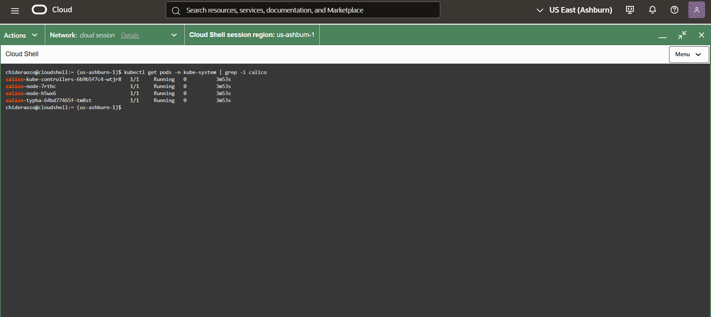
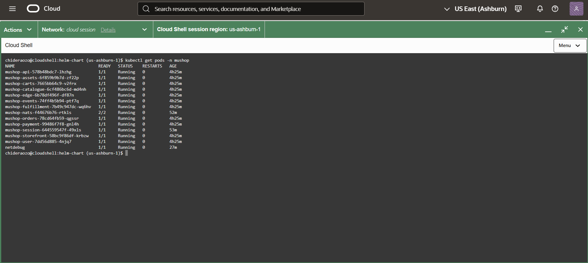
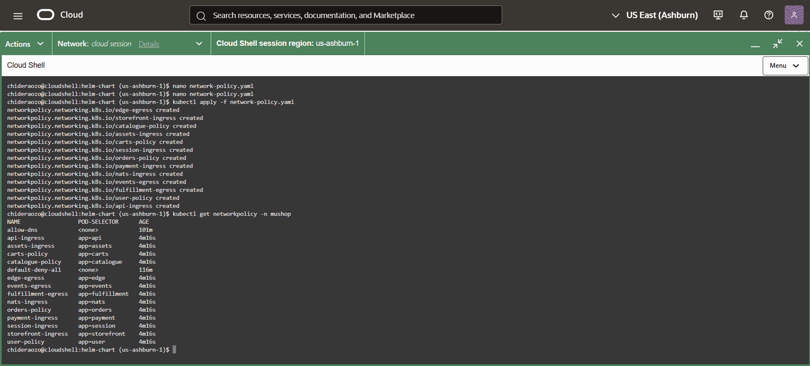
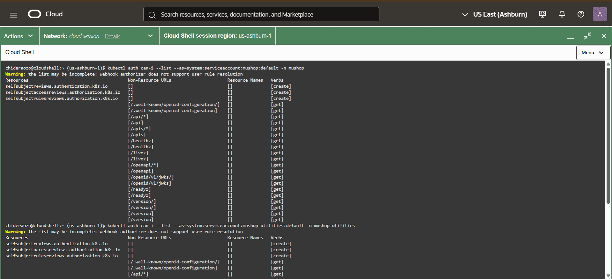
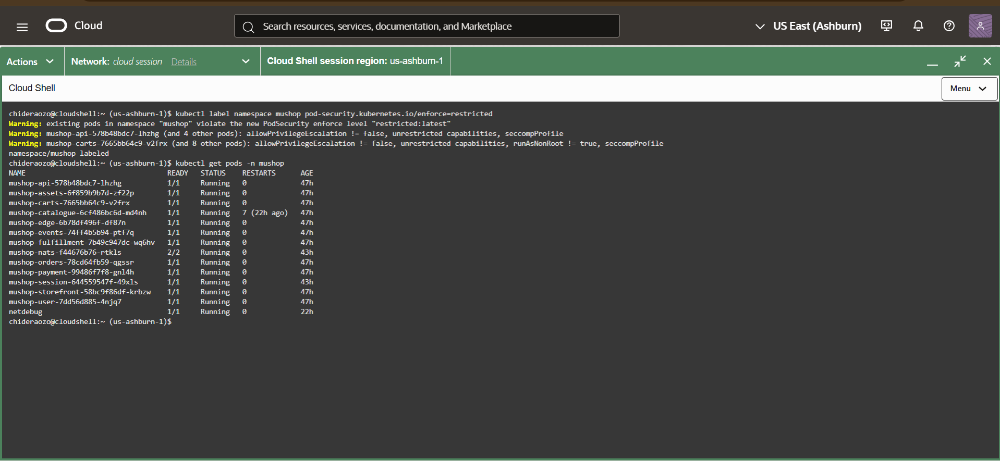
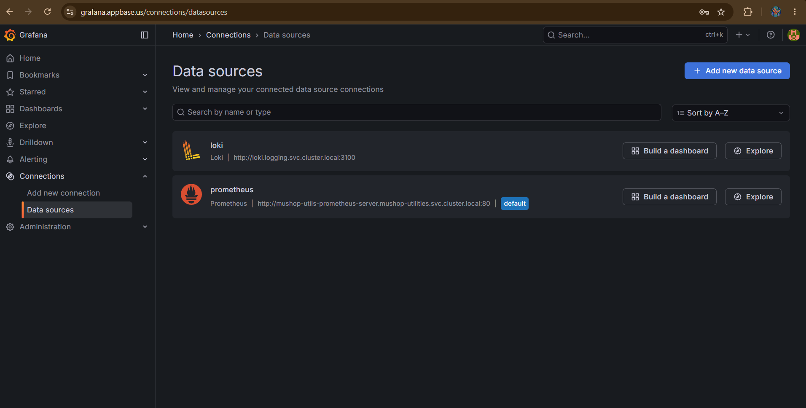
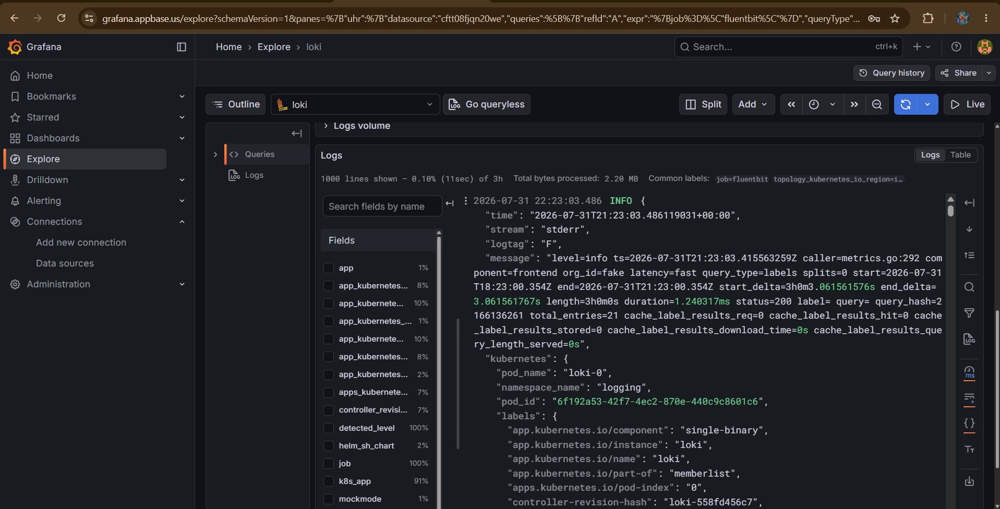
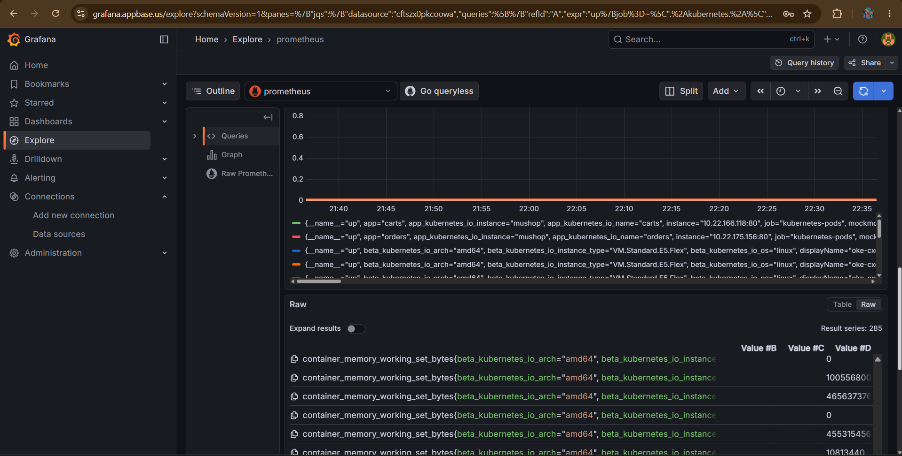
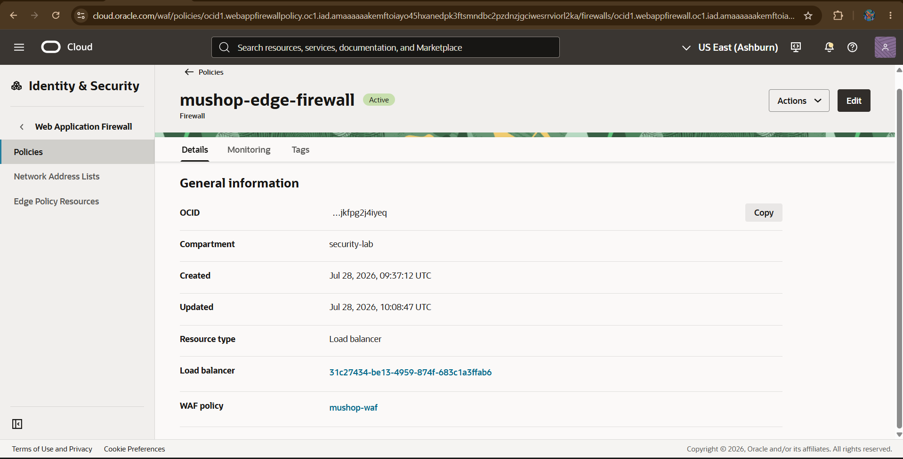
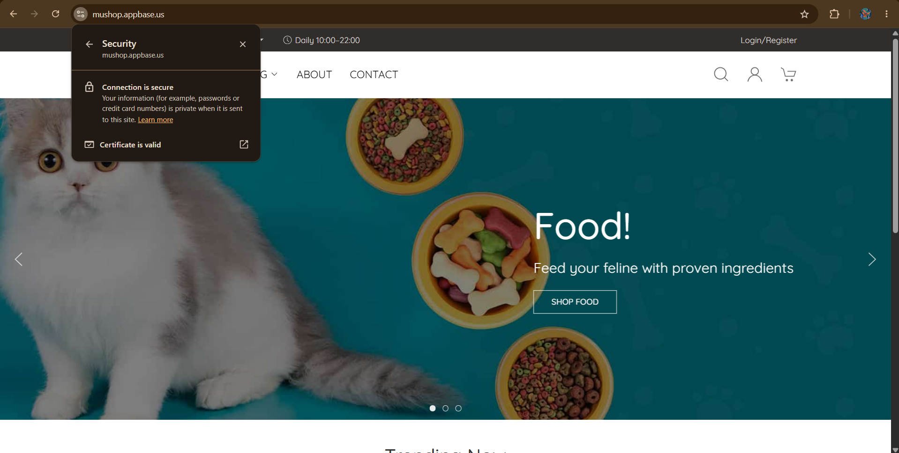

# Zero-Trust Multi-Tier Platform on OKE

A private, network-policy-enforced Kubernetes platform running a real 13-service application on Oracle Cloud Infrastructure.

This project was built incrementally rather than as a clean-room deployment. The documentation deliberately includes the failures, architectural constraints, debugging, trade-offs, and unfinished phases because those are often more valuable than a list of successfully executed commands.

---

## Architecture

* **Cloud:** Oracle Cloud Infrastructure
* **Kubernetes:** Oracle Kubernetes Engine (OKE)
* **Cluster:** Private Kubernetes API endpoint
* **Cluster type:** Basic OKE cluster
* **Networking:** OCI VCN-Native Pod Networking
* **Network policy:** Calico, policy-only mode
* **Nodes:** 2 × `VM.Standard.E5.Flex`, 2 OCPU / 16 GB
* **OS:** Oracle Linux 9.7
* **Application:** MuShop, 13 independent microservices
* **Deployment:** Helm
* **Access:** OCI Cloud Shell attached to the VCN
* **Ingress:** ingress-nginx
* **Observability:** Prometheus, Grafana, Loki and Fluent Bit
* **Infrastructure:** Terraform
* **Security controls:** NetworkPolicy, Kubernetes RBAC audit, Pod Security Standards, container security contexts, monitoring and logging

The target architecture was to progressively remove implicit trust:

```text
                         Internet
                            │
                       Edge / WAF
                            │
                     OCI Load Balancer
                            │
                       ingress-nginx
                            │
                ┌───────────┴───────────┐
                │       Kubernetes      │
                │                       │
                │  default-deny policy  │
                │          │            │
                │     13 services       │
                │          │            │
                │   explicit identity  │
                │   based communication│
                └───────────────────────┘
                            │
                 Observability layer
              Prometheus / Loki / Grafana
```
[🖼️ View Architecture Diagram (PNG)](screenshots\architecture.png)

The final identity architecture was planned to extend this further with workload identity and external secret management, but those phases were not completed because the OCI trial expired.

---

# Phase 1 — Cluster Provisioning

The cluster was provisioned with Terraform using Oracle's `terraform-oci-oke-quickstart` module.

The module was pinned to release `0.9.3`.

### Problems encountered

#### 1. Provider/module compatibility

The initial module reference was too old for the provider constraints being used locally.

Rather than changing the entire Terraform configuration, the module reference was moved to the newer stable release.

**Lesson:** Terraform modules are dependencies too. A configuration can be syntactically correct and still fail because the module and provider versions no longer agree.

#### 2. OKE image selection

The module's image-selection logic selected the newest matching Compute image rather than verifying that the image was certified for OKE node pools.

The resulting worker image was not appropriate for the OKE node pool.

The fix was to query OKE's own node-pool image options and use a certified image OCID explicitly.

**Lesson:** "Latest image" and "latest supported image" are not necessarily the same thing.

#### 3. Node shape availability

The original design used `VM.Standard.E4.Flex`, but that shape was not available in the tenancy.

Availability was checked directly through OCI rather than continuing to troubleshoot Terraform.

The node pool was changed to `VM.Standard.E5.Flex`.

#### 4. Terraform state drift

A failed partial deployment left OCI-generated system tags different from Terraform's state.

The resulting plan attempted to replace a large portion of the environment.

The clean solution was to destroy the incomplete infrastructure and rebuild after correcting the underlying configuration.

---

# Phase 2/3 — Calico NetworkPolicy Enforcement

The cluster uses OCI VCN-Native Pod Networking for IP allocation.

Calico was deliberately installed in policy-only mode.

That distinction matters:

```text
VCN-Native CNI
    │
    └── Pod IP addressing / networking

Calico
    │
    └── NetworkPolicy enforcement
```

Calico was not being used as the pod networking layer.

### Failure 1 — Calico RBAC

New pods initially failed to start because the Calico CNI component could not read its own Calico resources.

The error pointed to:

`clusterinformations.crd.projectcalico.org "default" is forbidden`

The problem was a missing permission in the Calico CNI ClusterRole.

The permission was patched and pod creation progressed far enough to expose the next problem.

### Failure 2 — Wrong Calico installation assumptions

The generic Calico policy-only manifest assumed Calico would participate in pod networking and IP allocation.

That conflicted with OKE's VCN-Native networking.

The resulting failure was:

`no podCidr for node`

The manifest was adjusted according to Oracle's documented requirements for Calico policy-only enforcement on VCN-Native OKE.

The changes included removing networking-related initialization and configuring Felix to operate against the OCI networking model.

### Failure 3 — Authentication vs authorization

The RBAC error later returned, but this time as `Unauthorized` rather than `Forbidden`.

That distinction was important:

* **Forbidden** → authenticated but not authorized
* **Unauthorized** → authentication itself failed

The worker nodes had originally booted before the Calico RBAC configuration existed and had cached invalid CNI credentials.

Applying the RBAC objects again did not refresh those credentials.

The node pool therefore had to be cycled by scaling it down and back up.

New nodes booted after the correct RBAC configuration existed.

### Result

Calico successfully enforced Kubernetes NetworkPolicies without taking over OCI's pod IP management.



---

# Phase 4 — MuShop Deployment

MuShop was deployed using Helm in mock mode:

```text
global.mock.service=all
```

This intentionally avoided requiring real databases, object storage or messaging services while still giving the cluster a realistic multi-service workload.

The application consists of 13 independent services:

* edge
* storefront
* catalogue
* carts
* orders
* payment
* user
* assets
* api
* events
* fulfillment
* nats
* session

### Container image failure

`nats` and `session` failed with `ImageInspectError`.

The cause was CRI-O's short-name enforcement.

Images such as:

```text
nats:2.7.1
redis:alpine
```

were ambiguous because the runtime would not guess which registry should supply them.

They were changed to explicit references:

```text
docker.io/library/nats:2.7.1
docker.io/library/redis:alpine
```

This is also a security control against image dependency confusion.



---

# Phase 5 — Zero-Trust Network Policy

The network policy design started with a namespace-wide default deny:

```text
Ingress: DENY
Egress: DENY
```

DNS was explicitly allowed because workloads cannot function without DNS resolution.

After that, each service received only the traffic required by its position in the application graph.

For example:

```text
edge
 └──> storefront

storefront
 └──> catalogue

catalogue
 └──> assets

orders
 └──> payment
```

The goal was not "make the application work."

The goal was:

> Make the application work while allowing nothing that the application does not actually need.

### Enforcement test

The payment service was used as a controlled test target.

Three requests were made:

| Source                               | Result  |
| ------------------------------------ | ------- |
| Unlabelled test pod                  | Blocked |
| `catalogue` service                  | Blocked |
| Same test pod relabelled as `orders` | Allowed |

The destination did not change.

The source pod did not change.

The only meaningful change was the workload identity represented by its labels.

That demonstrated the intended policy model: **access is determined by identity and policy, not simply by network location.**



---

# Phase 6 — Kubernetes RBAC Audit

Kubernetes RBAC was investigated separately from NetworkPolicy.

This distinction is important:

```text
NetworkPolicy
    ↓
Who can communicate with whom?

RBAC
    ↓
Who can call the Kubernetes API, and what can they do?
```

The default ServiceAccount permissions were checked with:

```bash
kubectl auth can-i --list \
  --as=system:serviceaccount:<namespace>:default
```

The default posture was already relatively restrictive.

The ServiceAccounts could perform limited discovery/self-review operations but did not have broad permissions over:

* Pods
* Secrets
* ConfigMaps
* cluster state
* workloads

No unnecessary remediation was introduced simply for the sake of having a custom Role.

### Modification

The next step was to replace default ServiceAccount usage with explicit application ServiceAccounts and define least-privilege Roles/ClusterRoles where required.

For example, if a controller only needs to read ConfigMaps:

```text
              Role
       "Can get/list ConfigMaps"
                ▲
                │
         RoleBinding
                │
                ▼
       ServiceAccount
       "nats-controller"
                │
                ▼
             Pod
```



---

# Phase 7 — Pod Security Standards

The Kubernetes `restricted` Pod Security Standard was enabled at namespace level.

```bash
kubectl label namespace mushop \
  pod-security.kubernetes.io/enforce=restricted
```

This immediately exposed real container-hardening gaps.

Common findings included:

* `allowPrivilegeEscalation` not disabled
* no `seccompProfile`
* unrestricted Linux capabilities
* containers not explicitly configured to run as non-root

Rather than modifying all 13 services at once, two were selected deliberately:

* `api` — representative application
* `payment` — security-sensitive application

### Interesting failure

The `api` chart appeared to drop all Linux capabilities:

```yaml
capabilities:
  drop:
    - all
```

But Kubernetes capability names are case-sensitive.

The correct value is:

```yaml
capabilities:
  drop:
    - ALL
```

The configuration looked correct to a human but was not actually enforcing the intended setting.

Both services were corrected through Helm values instead of manually editing running Pods.

That means the security posture survives the next deployment.

The remaining 11 services were documented as known remediation work.



---

# Phase 8 — Resiliency and Health Checks

Liveness and readiness probes were audited across all 13 services.

Most already had working probes.

Three required additional investigation:

### `carts`

The service exposed a real health endpoint through its Spring Boot Actuator-style implementation.

The endpoint checked more than whether the process was alive, including application dependencies.

### `events`

`events` does not have legitimate NetworkPolicy ingress from the other application services.

It primarily communicates through NATS.

Therefore, testing it by simply curling the Pod from another workload would give the wrong answer.

The correct test was to execute the health check from inside the Pod.

### `nats`

NATS is not an ordinary HTTP application.

It exposes a dedicated health endpoint on:

```text
:8222/healthz
```

The probe therefore needed to target the service's actual health interface rather than assuming every service has `/health`.

### Important Kubernetes behavior

Kubernetes probes are executed by the kubelet against the Pod.

They do not represent ordinary pod-to-pod application traffic.

Therefore, Calico NetworkPolicy does not treat a kubelet probe as another workload communicating across the application network boundary.

---

# Phase 9 — Observability

The monitoring layer was built around four components:

```text
Applications
    │
    ├── metrics ───────> Prometheus
    │
    └── stdout/stderr
              │
              ▼
          Fluent Bit
              │
              ▼
             Loki
              │
              ▼
           Grafana
```

### Prometheus

Prometheus was used for metrics and Kubernetes/service discovery.

The configuration used Kubernetes discovery for:

* API servers
* nodes
* cAdvisor
* service endpoints
* Pods
* Pushgateway

Prometheus was connected to Grafana as a datasource.

### Fluent Bit + Loki

Application containers generally write logs to stdout/stderr.

The container runtime persists those streams as node-level container log files.

Fluent Bit runs as a DaemonSet so each worker node can collect the logs generated locally.

The flow is:

```text
Application
    ↓
stdout / stderr
    ↓
container runtime
    ↓
node log files
    ↓
Fluent Bit
    ↓
Loki
    ↓
Grafana
```

Loki stores the logs in a label-oriented structure rather than functioning like a traditional full-text database.

Grafana then provides the common interface for querying both:

```text
Metrics → Prometheus
Logs    → Loki
```

### Practical debugging

The monitoring phase exposed configuration issues rather than being a simple installation exercise.

Grafana initially required datasource configuration before Prometheus and Loki could be meaningfully queried.

Loki queries also demonstrated an important LogQL distinction: a label selector such as:

```logql
{job="fluentbit"}
```

requires that the label actually exist and have a usable value.

The monitoring layer was ultimately brought to the point where Prometheus and Loki could be queried from Grafana.

### Alerting

Alertmanager was already deployed:

```text
mushop-utils-alertmanager-0
```

However, the cluster did not have the Prometheus Operator `PrometheusRule` CRD available.

A direct Prometheus alerting rule was therefore attempted through the Prometheus ConfigMap.

The first configuration contained malformed YAML and caused Prometheus to reject the rule set.

After correcting the rule syntax, an update conflict occurred because the Helm-managed ConfigMap had changed between reads and the attempted `kubectl apply`.

This exposed another architectural issue:

> A Helm-managed resource should not casually become a manually managed resource.

The intended production solution would be to manage alert rules declaratively through the Prometheus deployment mechanism rather than repeatedly editing the generated ConfigMap.

The environment expired before the alerting layer could be fully completed and validated end-to-end.





---

# Phase 10 — Edge Security / WAF

The next security boundary was the application edge.

The intended model was:

```text
Internet
   │
   ▼
External Edge / WAF
   │
   ▼
OCI Load Balancer
   │
   ▼
ingress-nginx
   │
   ▼
Kubernetes Services
```

The objective was to ensure that application traffic is inspected and controlled before reaching the cluster's ingress layer.

OCI WAF was configured and investigated, including:

* WAF policy
* firewall
* access control rules
* protection rules
* rate limiting
* logging

### Problems encountered

Traffic was not appearing in WAF logs as expected.

Protection rules were initially configured for `Check` before being changed toward blocking behavior, but the expected enforcement was still not observed.

At the same time, TLS termination was occurring at the ingress layer, which complicated determining exactly where the request was being inspected and what the WAF could see.

Findings indicated that the Cloud LoadBalancer which the OCI WAF was sitting infront of was set as "pass-through", which meant the WAF was recieving encrypted traffic which it couldn't read. traffic was being encrypted at ingress layer not LB layer.  

The project also explored Cloudflare as an external edge/CDN/WAF option, for SSL bridging, but the integration was not completed before the OCI trial expired.

### What would be completed next

The next iteration would establish one clearly defined traffic path and test each hop independently:

```text
Client
  ↓
Cloudflare / WAF
  ↓
OCI Load Balancer
  ↓
ingress-nginx
  ↓
Service
  ↓
Pod
```

Each layer would then be verified independently using request logs and source information.

The key lesson was that adding a WAF is not enough.

You need to prove:

1. traffic actually passes through it;
2. the WAF can inspect the relevant traffic;
3. its rules are being evaluated;
4. blocking actually occurs;
5. the backend cannot be reached through an unintended alternate path.



---

# Phase 11 — Workload Identity

This phase was planned but could not be implemented on the cluster that was built.

The important architectural distinction is:

```text
Kubernetes RBAC
    │
    └── Controls access to the Kubernetes API

OCI Workload Identity
    │
    └── Controls which OCI resources a Pod can access
```

The cluster was a **Basic OKE cluster**.

OCI's current documentation confirms that Workload Identity is an Enhanced Cluster feature and is not available on Basic Clusters.

This was therefore an architectural constraint rather than a missing Kubernetes YAML file.

### Intended design

For example, suppose the `payment` service needed to read an OCI Object Storage bucket.

The desired architecture would be:

```text
payment Pod
    │
    ▼
Kubernetes ServiceAccount
    │
    ▼
OKE Workload Identity
    │
    ▼
OCI IAM
    │
    ▼
Object Storage
```

The Pod would not contain an OCI API key.

OCI IAM would authorize the specific workload identity for only the required resource.

This is significantly better than giving an entire worker node broad OCI permissions.

### What would change

The cluster would need to be upgraded to an Enhanced Cluster or rebuilt as one.

Then the workload identity would be scoped to a specific namespace, ServiceAccount and cluster rather than granting broad permissions.

---

# Phase 12 — Secrets and External Secret Management

This phase was also planned but not completed.

The goal was to avoid treating Kubernetes Secrets as the final destination for sensitive application credentials.

A future design would separate two concerns:

```text
Identity
    │
    └── Workload Identity
          ↓
      "Who is this Pod?"

Secret management
    │
    └── OCI Vault / external secret store
          ↓
      "What secret may this Pod retrieve?"
```

These solve different problems.

### Example

Suppose `orders` needs a database credential.

A weak model would be:

```text
Pod
 ↓
Kubernetes Secret
 ↓
DB password
```

A stronger model would be:

```text
orders Pod
     │
     ▼
Workload Identity
     │
     ▼
OCI IAM
     │
     ▼
OCI Vault
     │
     ▼
Database credential
```

The Pod authenticates using its workload identity rather than carrying a long-lived cloud credential.

Vault then becomes the system responsible for storing and rotating the sensitive secret.

### Why both controls matter

Workload Identity answers:

> "Who is requesting access?"

Vault answers:

> "What secret should that identity receive?"

IAM/Vault policies answer:

> "Is that identity allowed to retrieve it?"

This creates a much cleaner identity chain than putting long-lived cloud credentials or application passwords directly into manifests.

---

# Phase 13 — Final Zero-Trust Model

The project was intentionally built as a series of independent trust boundaries.

```text
                    INTERNET
                       │
                 Edge / WAF
                       │
                OCI Load Balancer
                       │
                 ingress-nginx
                       │
              ┌────────┴────────┐
              │   Kubernetes    │
              │                 │
              │ NetworkPolicy   │
              │      ↓          │
              │ ServiceAccount  │
              │      ↓          │
              │ Kubernetes RBAC │
              │      ↓          │
              │ Pod Security    │
              │      ↓          │
              │ Applications    │
              └────────┬────────┘
                       │
              Observability layer
            Prometheus / Loki / Grafana
                       │
              ┌────────┴────────┐
              │                 │
       Workload Identity      Vault
              │                 │
           OCI IAM          Secrets
              │
        OCI Resources
```

Not every box was completed.

That is an important part of the project record.

### Completed

* Private OKE API
* VCN-Native networking
* Calico NetworkPolicy enforcement
* Default-deny network posture
* Service-specific network policies
* NetworkPolicy identity testing
* MuShop 13-service deployment
* Fine-grained application RBAC
* Container image hardening
* Kubernetes RBAC audit
* Pod Security Standards enforcement
* `api` and `payment` container hardening
* Health/probe investigation
* Prometheus
* Loki
* Fluent Bit
* Grafana datasources
* Metrics and log querying

### Partially completed / investigated

* Alertmanager alerting
* Resiliency/probe remediation for all services
* OCI WAF enforcement
* Edge traffic path
* Cloudflare integration

### Planned but blocked by architecture/trial limitations

* OKE Workload Identity
* Enhanced Cluster migration
* External secret management / OCI Vault
* Full cloud-resource identity flow
* Final WAF/edge validation

---

# What this project actually demonstrates

The strongest part of this project is not that every security feature was eventually checked off.

It demonstrates the process of taking a relatively open Kubernetes application and progressively reducing trust:

1. Remove public control-plane exposure.
2. Control service-to-service communication.
3. Verify Kubernetes API permissions.
4. Harden container privileges.
5. Add observability.
6. Introduce an edge security boundary.
7. Move from static credentials toward workload identity.
8. Move secrets out of the application deployment layer.

The unfinished phases are therefore not hidden.

They define the next iteration of the architecture.




Note:: This repo is for the underlying infrastructure, the actual workload is on the repo - https://github.com/Alpaccino04/Zero-Trust-OKE-Project-Workload-.git